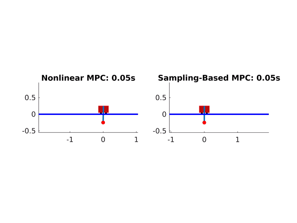

# Studienarbeit
Student Research Project code of Nonlinear-MPC and Information Theoretic MPC for Mechanical Systems (https://www.cc.gatech.edu/~bboots3/files/InformationTheoreticMPC.pdf).

## Examples
This section provides animations made with the repository code. The first example presents an inverted pendulum. The others examples shows a single track model.
# Inverted Pendulum
Comparison of inverted pendulum controlled by a Nonlinear MPC and the Information Theoretic MPC

# Single Track Model
Single track model controlled by the Information Theoretic MPC in different situations
* Dynamic Obstacles
(dynamic_obstacles.gif)
* Racetrack

* Sharp corners

* Static obstacles

