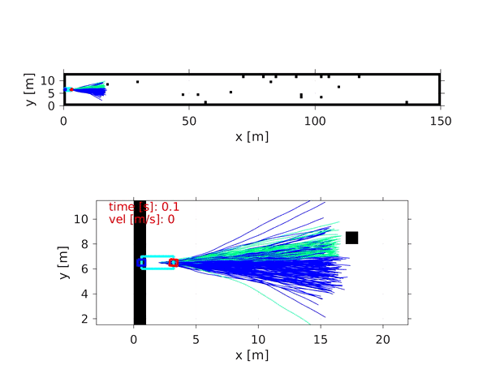

# Studienarbeit
Student Research Project done with the Institute for Technical and Numerical Mechanics (ITM), University of Stuttgart. This repository presents a MATLAB code for Nonlinear-MPC and Information Theoretic MPC for Mechanical Systems (https://www.cc.gatech.edu/~bboots3/files/InformationTheoreticMPC.pdf).
Here, we show an inverted pendulum using both controllers. Furthermore, the IT-MPC is used for controlling a single track bicycle model.

## Preliminaries
For using the code, it is necessary to install Matlab Robotics Toolbox.
Not all code is yet online, more is coming!

## Examples
This section provides animations made with the repository code. The first example presents an inverted pendulum. The others examples show a single track model being controlled with IT-MPC.

### Inverted Pendulum
Comparison of inverted pendulum controlled by a Nonlinear MPC and the Information Theoretic MPC. We use NMPC with terminal constraints to guarantee convergence and stabiltiy to the controlled system. The optimization is done using Sequential Quadratic Programming (SQP) method. 

### Single Track Model
Single track model simplifies a car model into 10 states and 5 control inputs see the book Vehicle Dynamics Modeling and Simulation from Schramm, Dieter, Hiller, Manfred and Bardini, Roberto. We use Information Theoretic MPC for contorlling the vehicle in different situations
#### Dynamic Obstacles
Here the vehicle has to reach the end of the corridor without colliding with obstacles, these move with a velocity of 1 m/s. The trajectories sampled by IT-MPC can be seen coming out of the bicycle, the colors blue represents a lower cost trajectory, while green a higher cost.
	
#### Racetrack
Here the robot runs in a infinity shaped track achieving a velocity up to 20m/s. 
	
#### Sharp corners
Here we see the vehicle dealing with sharp corners, in which the sampling procedure presents a higher degree of dificulty.
	
#### Static obstacles
Here we provided static obstacles introducing a higher modality to the system.
	

